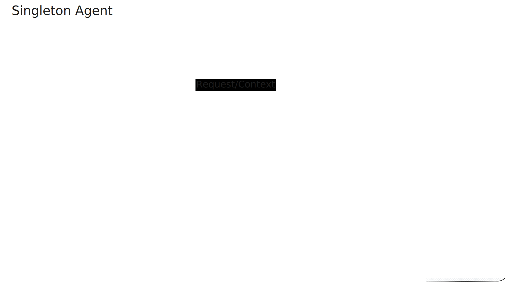
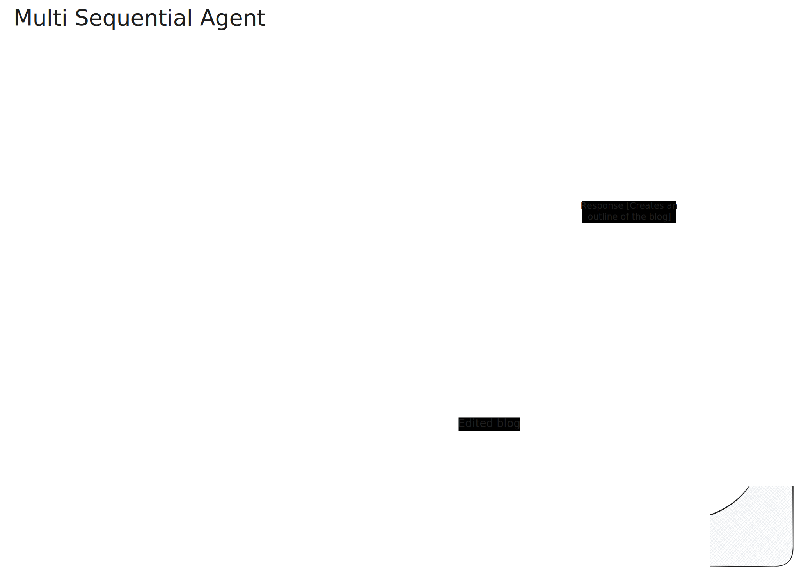
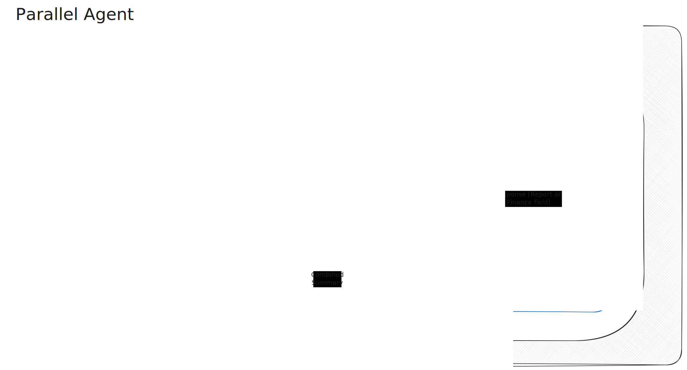
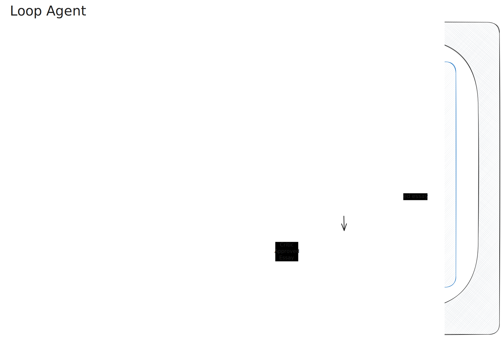

# Agent Development Kit (ADK) Application

This repository contains several examples of Google ADK agents, demonstrating different patterns and architectures.

## Prerequisites

- Python 3.10+
- Google Cloud API Key (for Gemini)

## Setup

1. **Install dependencies:**

   ```bash
   pip install -r requirements.txt
   ```

2. **Configure Environment:**
   Ensure you have a `.env` file (copy from `.env.example`) with your API key:
   ```
   GOOGLE_API_KEY=your_api_key_here
   ```

## Agent Models

This repository showcases four distinct agent models, each demonstrating a different capability of the ADK.

### 1. Singleton Agent (`my_agent/`)



**Summary:** A basic, helpful assistant powered by Gemini 2.5 Flash Lite with access to Google Search.

- **Structure:** Single `Agent`
- **Workflow:** Direct interaction with the LLM.
- **Tools:** Google Search.
- **Features:** Includes retry logic for robust API handling.

### 2. Multi-Agent Pipeline (`my_multi_agent/`)



**Summary:** A sequential production line for creating blog posts, simulating a real-world editorial team.

- **Structure:** `SequentialAgent` (Root)
- **Workflow:**
  1.  **Outline Agent**: Creates a structured outline for the topic.
  2.  **Writer Agent**: Expands the outline into a full draft.
  3.  **Editor Agent**: Polishes the draft for tone and clarity.

### 3. Parallel Agent (`parallel_agent/`)



**Summary:** A comprehensive research system that performs simultaneous investigations across different domains before synthesizing the findings.

- **Structure:** `SequentialAgent` (Root) containing a `ParallelAgent`.
- **Workflow:**
  1.  **Parallel Research Team**: Runs three agents simultaneously:
      - **Tech Researcher**: Investigates technology trends.
      - **Finance Researcher**: Analyzes financial implications.
      - **Health Researcher**: Explores health-related aspects.
  2.  **Aggregator Agent**: Combines insights from all three researchers into a final report.

### 4. Loop Agent (`loop_agent/`)



**Summary:** An iterative story writer that improves its work through cycles of critique and refinement.

- **Structure:** `SequentialAgent` (Root) -> `LoopAgent`
- **Workflow:**
  1.  **Initial Writer**: Drafts a story based on a prompt.
  2.  **Refinement Loop**:
      - **Critic**: Reviews the story and provides feedback.
      - **Refiner**: Improves the story based on the critique.
      - _Repeats for up to 3 iterations._
## Running the Application

### 1. Web UI (Recommended)

Launch the visual interface to chat with your agent and see traces:

```bash
# Run from the project root
adk web
```

Access the UI at: http://localhost:8000

### 2. Interactive CLI

Chat with a specific agent in the terminal:

```bash
# Example: Run the simple agent
adk run my_agent

# Example: Run the parallel research system
adk run parallel_agent
```
